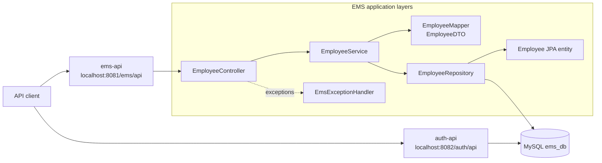

# VIA Enterprise

VIA Enterprise is a Java 21, multi-module Maven project composed of independent
Spring Boot APIs. The current repository contains an Employee Management System
(EMS) API and the foundation for an Authentication API.

## Project composition

| Module | Purpose | Port | Context path | Current status |
| --- | --- | ---: | --- | --- |
| `ems-api` | Employee CRUD operations | `8081` | `/ems/api` | Implements the employee REST API |
| `auth-api` | Authentication service foundation | `8082` | `/auth/api` | Application and OpenAPI configuration only; no business endpoints yet |

The root `pom.xml` is the Maven parent and aggregator. It centralizes the
Spring Boot parent, Java version, dependency versions, and build plugin shared
by both modules.

### Technology stack

- Java 21
- Spring Boot 4.1
- Spring Web MVC
- Spring Data JPA
- MySQL
- springdoc-openapi and Swagger UI
- MapStruct mapping contracts
- Maven

## Architecture

Each API is an independently runnable Spring Boot application with its own
configuration, port, context path, logs, and OpenAPI definition. Both services
are currently configured to connect to the same local MySQL database,
`ems_db`.



### EMS request flow

1. `EmployeeController` exposes the versioned REST resource.
2. `EmployeeServiceImpl` applies the use-case logic and handles missing
   employees.
3. `EmployeeMapper` converts between the API-facing `EmployeeDTO` and the
   persistence-facing `Employee` entity.
4. `EmployeeRepository` uses Spring Data JPA to access the `employees` table.
5. `EmsExceptionHandler` converts a missing employee into a consistent `404`
   response.

### Source layout

```text
via-enterprise/
├── pom.xml                         # Parent and module aggregator
├── ems-api/
│   ├── pom.xml
│   └── src/
│       ├── main/java/com/via/ems/
│       │   ├── config/             # OpenAPI metadata
│       │   ├── controllers/        # HTTP endpoints
│       │   ├── dto/                # Request/response records
│       │   ├── exception/          # API exception translation
│       │   ├── mapper/             # DTO/entity mapping
│       │   ├── model/              # JPA entities
│       │   ├── repository/         # Spring Data repositories
│       │   └── service/            # Business logic
│       └── main/resources/
│           └── application.properties
└── auth-api/
    ├── pom.xml
    └── src/main/
        ├── java/com/via/auth/
        │   └── config/             # OpenAPI metadata
        └── resources/
            └── application.properties
```

## API documentation

When a module is running, springdoc generates an OpenAPI document from the
application configuration and controller annotations.

| Module | Swagger UI | OpenAPI JSON |
| --- | --- | --- |
| EMS API | <http://localhost:8081/ems/api/swagger-ui.html> | <http://localhost:8081/ems/api/api-docs> |
| Authentication API | <http://localhost:8082/auth/api/swagger-ui.html> | <http://localhost:8082/auth/api/api-docs> |

The Authentication API currently has no controllers, so its OpenAPI document
contains service metadata but no application endpoints.

### EMS endpoints

Base URL: `http://localhost:8081/ems/api`

| Method | Path | Description | Success | Other documented responses |
| --- | --- | --- | --- | --- |
| `POST` | `/v1/employees` | Create an employee | `201 Created` with the created employee | — |
| `GET` | `/v1/employees` | List all employees | `200 OK` with an array | — |
| `GET` | `/v1/employees/{id}` | Get an employee by ID | `200 OK` with the employee | `404 Not Found` |
| `PUT` | `/v1/employees/{id}` | Replace an employee's editable details | `200 OK` with the updated employee | `404 Not Found` |
| `DELETE` | `/v1/employees/{id}` | Delete an employee | `200 OK` with a confirmation message | `404 Not Found` |

`id` is a database-generated integer. Employee request and response bodies use
the following shape:

```json
{
  "id": 1,
  "firstName": "Ada",
  "lastName": "Lovelace",
  "email": "ada@example.com"
}
```

For create and update requests, clients can omit `id`; the create operation
generates it, while the update operation identifies the employee from the path.
The `email` column is required and unique in the database.

Example create request:

```bash
curl --request POST \
  --url http://localhost:8081/ems/api/v1/employees \
  --header "Content-Type: application/json" \
  --data '{
    "firstName": "Ada",
    "lastName": "Lovelace",
    "email": "ada@example.com"
  }'
```

Example not-found response:

```json
{
  "errorCode": "404",
  "errorMessage": "Employee not found with id=99"
}
```

## Running locally

### Prerequisites

- JDK 21
- Maven 3.9 or newer
- MySQL available on `localhost:3306`
- An `ems_db` database containing an `employees` table

Both modules read their datasource settings from their respective
`application.properties` files. Update those settings for your local MySQL
environment before starting the services. Hibernate schema generation is
disabled (`spring.jpa.hibernate.ddl-auto=none`), so the database schema must
already exist.

Build and test all modules from the repository root:

```bash
mvn clean verify
```

Run the EMS API:

```bash
mvn -pl ems-api spring-boot:run
```

Run the Authentication API in a second terminal:

```bash
mvn -pl auth-api spring-boot:run
```

The services write logs under the repository's `logs` directory.
