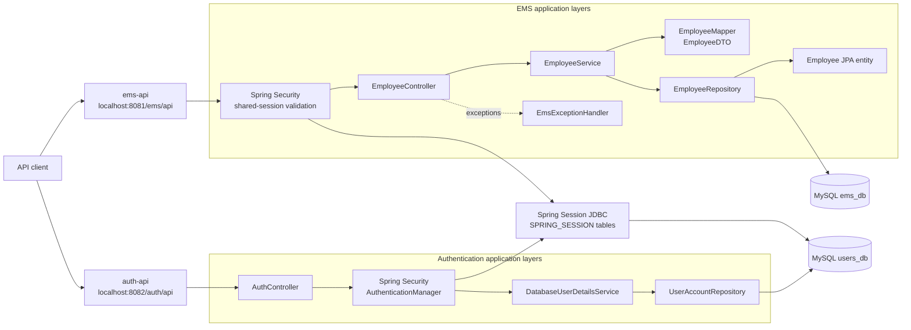

# VIA Enterprise

VIA Enterprise is a Java 21, multi-module Maven project composed of independent
Spring Boot APIs. The current repository contains an Employee Management System
(EMS) API and a session-based Authentication API.

## Project composition

| Module | Purpose | Port | Context path | Current status |
| --- | --- | ---: | --- | --- |
| `ems-api` | Employee CRUD operations | `8081` | `/ems/api` | Implements the employee REST API |
| `auth-api` | Email/password session authentication | `8082` | `/auth/api` | Implements login, logout, password change, automatic cookie-based CSRF, and current-session endpoints |

The root `pom.xml` is the Maven parent and aggregator. It centralizes the
Spring Boot parent, Java version, dependency versions, and build plugin shared
by both modules.

### Technology stack

- Java 21
- Spring Boot 4.1
- Spring Web MVC
- Spring Data JPA
- Spring Security
- Spring Session JDBC
- BCrypt password hashing
- Flyway database migrations
- MySQL
- springdoc-openapi and Swagger UI
- MapStruct mapping contracts
- Maven

## Architecture

Each API is an independently runnable Spring Boot application with its own
configuration, port, context path, logs, and OpenAPI definition. The EMS API
stores employee data in `ems_db`, while the Authentication API stores users and
shared JDBC sessions in `users_db`.



### EMS request flow

1. Spring Security reads `JSESSIONID`, loads its security context from the
   shared `SPRING_SESSION` tables, and rejects unauthenticated requests.
2. `EmployeeController` exposes the versioned REST resource.
3. `EmployeeServiceImpl` applies the use-case logic and handles missing
   employees.
4. `EmployeeMapper` converts between the API-facing `EmployeeDTO` and the
   persistence-facing `Employee` entity.
5. `EmployeeRepository` uses Spring Data JPA to access the `employees` table.
6. `EmsExceptionHandler` converts a missing employee into a consistent `404`
   response.

### Authentication request flow

1. `AuthController` passes the submitted email and password to Spring
   Security's `AuthenticationManager`.
2. `DatabaseUserDetailsService` loads the enabled user from `auth_users`, and
   BCrypt verifies the submitted password against `password_hash`.
3. Successful login rotates the session ID, saves the security context in the
   shared `SPRING_SESSION` tables, and returns both `JSESSIONID` and
   `XSRF-TOKEN` cookies with path `/`.
4. The browser sends `JSESSIONID` to both `/auth/api` and `/ems/api`. EMS
   restores the authentication from the shared JDBC session before processing
   employee requests.
5. Swagger UI or the web client reads `XSRF-TOKEN` and automatically mirrors
   it into the `X-XSRF-TOKEN` header for state-changing requests.
6. Logout or a successful password change deletes the shared session, so the
   user immediately loses access to EMS as well.

### Source layout

```text
via-enterprise/
├── pom.xml                         # Parent and module aggregator
├── ems-api/
│   ├── pom.xml
│   └── src/
│       ├── main/java/com/via/ems/
│       │   ├── config/             # OpenAPI metadata
│       │   ├── controllers/        # HTTP endpoints
│       │   ├── dto/                # Request/response records
│       │   ├── exception/          # API exception translation
│       │   ├── mapper/             # DTO/entity mapping
│       │   ├── model/              # JPA entities
│       │   ├── repository/         # Spring Data repositories
│       │   └── service/            # Business logic
│       └── main/resources/
│           └── application.properties
└── auth-api/
    ├── pom.xml
    └── src/
        ├── main/java/com/via/auth/
        │   ├── config/             # Security, bootstrap user, and OpenAPI
        │   ├── controllers/        # Session authentication endpoints
        │   ├── dto/                # Authentication request/response records
        │   ├── exception/          # REST authentication errors
        │   ├── model/              # Authentication user entity
        │   ├── repository/         # Authentication user persistence
        │   └── security/           # Database-backed UserDetailsService
        └── main/resources/
            ├── db/migration/       # Flyway-managed authentication schema
            └── application.properties
```

## API documentation

When a module is running, springdoc generates an OpenAPI document from the
application configuration and controller annotations.

| Module | Swagger UI | OpenAPI JSON |
| --- | --- | --- |
| EMS API | <http://localhost:8081/ems/api/swagger-ui.html> | <http://localhost:8081/ems/api/api-docs> |
| Authentication API | <http://localhost:8082/auth/api/swagger-ui.html> | <http://localhost:8082/auth/api/api-docs> |

### Authentication endpoints

Base URL: `http://localhost:8082/auth/api`

| Method | Path | Description | Success | Other responses |
| --- | --- | --- | --- | --- |
| `POST` | `/v1/auth/login` | Log in and receive session and CSRF cookies | `200 OK` | `400`, `401` |
| `GET` | `/v1/auth/session` | Return the authenticated user | `200 OK` | `401 Unauthorized` |
| `PUT` | `/v1/auth/password` | Change the authenticated user's password | `204 No Content` | `400`, `401`, `403` |
| `POST` | `/v1/auth/logout` | Invalidate the session and expire both cookies | `204 No Content` | `401`, `403` |

Login request:

```json
{
  "email": "admin@example.com",
  "password": "a-strong-password"
}
```

Successful login and current-session response:

```json
{
  "email": "admin@example.com",
  "authorities": [
    "ROLE_USER"
  ]
}
```

Login does not require a separate CSRF request. Retain the cookies returned by
the successful login:

```bash
curl --request POST \
  --cookie-jar cookies.txt \
  --header "Content-Type: application/json" \
  --data '{
    "email": "admin@example.com",
    "password": "a-strong-password"
  }' \
  http://localhost:8082/auth/api/v1/auth/login
```

The response creates:

- `JSESSIONID`: HTTP-only authentication session cookie
- `XSRF-TOKEN`: CSRF cookie that JavaScript and Swagger UI can read

Swagger UI is configured to read `XSRF-TOKEN` and send it as
`X-XSRF-TOKEN` automatically. After logging in through **Try it out**, no
manual CSRF endpoint or per-operation CSRF field is needed. Safe requests such
as `GET /session` do not require the CSRF header.

Use the session on later requests:

```bash
curl --cookie cookies.txt \
  http://localhost:8082/auth/api/v1/auth/session
```

Change the authenticated user's password:

```bash
curl --request PUT \
  --cookie cookies.txt \
  --header "Content-Type: application/json" \
  --header "X-XSRF-TOKEN: <value-of-XSRF-TOKEN-cookie>" \
  --data '{
    "currentPassword": "a-strong-password",
    "newPassword": "NewPassword1!"
  }' \
  http://localhost:8082/auth/api/v1/auth/password
```

Command-line clients must still copy the `XSRF-TOKEN` cookie value into the
`X-XSRF-TOKEN` header for `POST`, `PUT`, `PATCH`, and `DELETE` requests.
Browsers using Swagger UI handle this automatically.

The new password must:

- Contain at least 8 characters
- Contain at least one uppercase letter
- Contain at least one number
- Contain at least one special character
- Contain no whitespace

The endpoint verifies the current password before updating it. A successful
change returns `204 No Content`, stores a new BCrypt hash, and invalidates the
current session. The user must log in again with the new password.

Passwords are never stored directly. The application compares the submitted
password with the BCrypt hash stored in `auth_users.password_hash`. Sessions
expire after 30 minutes of inactivity. The session cookie is HTTP-only and
uses `SameSite=Lax`; set `SESSION_COOKIE_SECURE=true` when serving the API over
HTTPS.

### EMS endpoints

Base URL: `http://localhost:8081/ems/api`

All employee endpoints require a valid session created by
`POST http://localhost:8082/auth/api/v1/auth/login`. Because the shared
`JSESSIONID` cookie has path `/`, a browser sends it to EMS automatically when
both APIs use the same host.

| Method | Path | Description | Success | Other documented responses |
| --- | --- | --- | --- | --- |
| `POST` | `/v1/employees` | Create an employee | `201 Created` with the created employee | — |
| `GET` | `/v1/employees` | List all employees | `200 OK` with an array | — |
| `GET` | `/v1/employees/{id}` | Get an employee by ID | `200 OK` with the employee | `404 Not Found` |
| `PUT` | `/v1/employees/{id}` | Replace an employee's editable details | `200 OK` with the updated employee | `404 Not Found` |
| `DELETE` | `/v1/employees/{id}` | Delete an employee | `200 OK` with a confirmation message | `404 Not Found` |

`id` is a database-generated integer. Employee request and response bodies use
the following shape:

```json
{
  "id": 1,
  "firstName": "Ada",
  "lastName": "Lovelace",
  "email": "ada@example.com"
}
```

For create and update requests, clients can omit `id`; the create operation
generates it, while the update operation identifies the employee from the path.
The `email` column is required and unique in the database.

Example create request:

```bash
curl --request POST \
  --url http://localhost:8081/ems/api/v1/employees \
  --header "Content-Type: application/json" \
  --data '{
    "firstName": "Ada",
    "lastName": "Lovelace",
    "email": "ada@example.com"
  }'
```

Example not-found response:

```json
{
  "errorCode": "404",
  "errorMessage": "Employee not found with id=99"
}
```

## Running locally

### Prerequisites

- JDK 21
- Maven 3.9 or newer
- MySQL available on `localhost:3306`
- `ems_db` and `users_db` databases on the same MySQL server

Both modules read their datasource settings from their respective
`application.properties` files. Update those settings for your local MySQL
environment before starting the services. Hibernate schema generation is
disabled (`spring.jpa.hibernate.ddl-auto=none`). The EMS `employees` table must
already exist in `ems_db`; the Authentication API creates and versions
`auth_users`, `SPRING_SESSION`, and `SPRING_SESSION_ATTRIBUTES` in `users_db`
with Flyway. Authentication migrations use a dedicated
`auth_flyway_schema_history` table.

Both APIs must connect to the same MySQL server. The EMS database account must
have access to `users_db` because its Spring Session table is configured as
`users_db.SPRING_SESSION`. Start `auth-api` first so Flyway can create the
shared session tables before EMS receives traffic.

Build and test all modules from the repository root:

```bash
mvn clean verify
```

Run the Authentication API:

```powershell
$env:AUTH_BOOTSTRAP_EMAIL = "admin@example.com"
$env:AUTH_BOOTSTRAP_PASSWORD = "a-strong-password"
mvn -pl auth-api spring-boot:run
```

The bootstrap environment variables are optional. When both are provided, the
service creates the user only if that email does not already exist, hashing the
password with BCrypt. Remove the variables after the initial user has been
created. Later startups leave the stored account unchanged.

To start the service without provisioning a user:

```bash
mvn -pl auth-api spring-boot:run
```

Run the EMS API in a second terminal:

```bash
mvn -pl ems-api spring-boot:run
```

On localhost, cookies are shared across ports automatically. If the services
use different subdomains in another environment, configure the same
`SESSION_COOKIE_DOMAIN` value in both applications. Set
`SESSION_COOKIE_SECURE=true` in both applications when using HTTPS.

The services write logs under the repository's `logs` directory.
